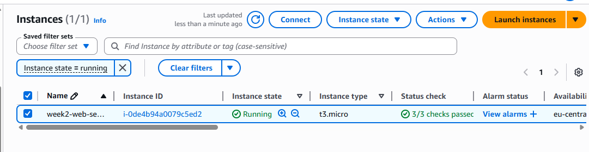
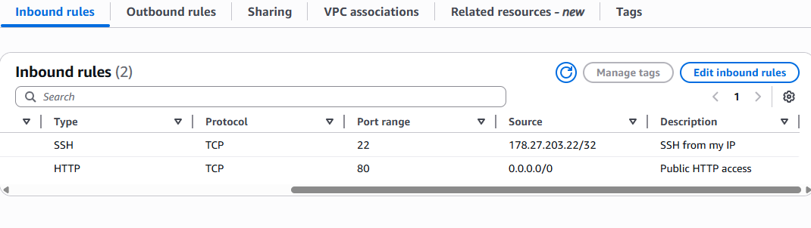
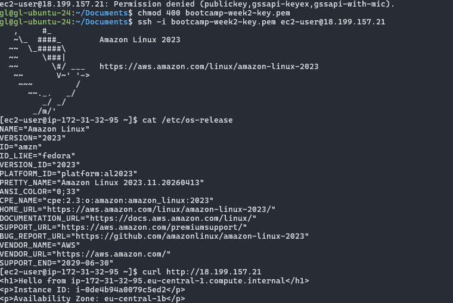
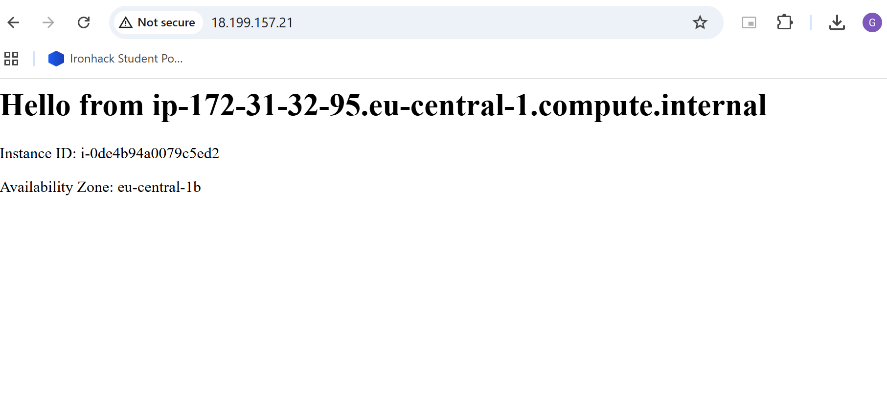
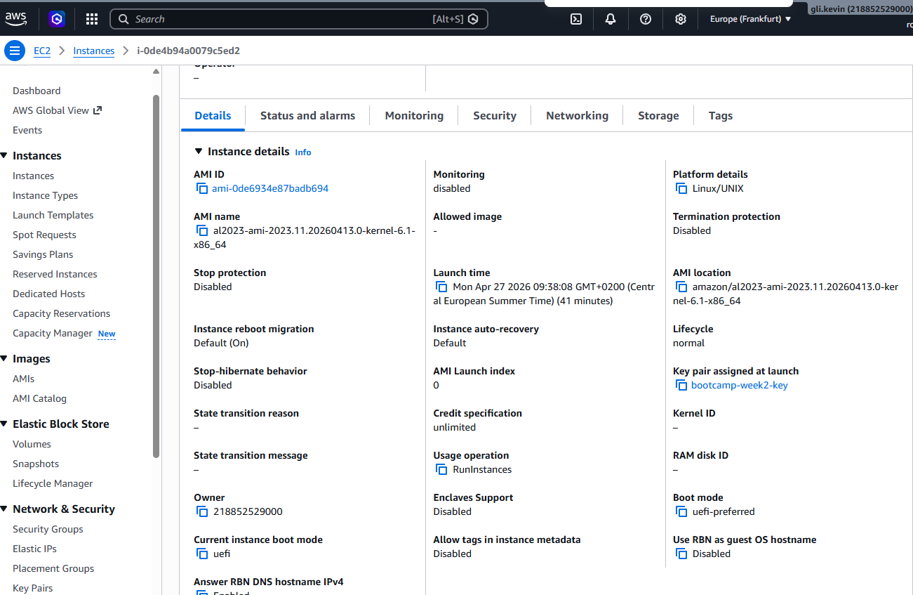

# ce-lab-launch-ec2-instance

## 👤 Basic Information
- **Name:** Guangzheng Li
- **Date:** 2026-04-27
- **Lab Title:** Launching and Configuring an Amazon EC2 Instance

---

## 📝 Lab Description
This lab demonstrates the process of launching a virtual server in the AWS Cloud. It covers selecting an Amazon Machine Image (AMI), configuring instance types, setting up security groups, and verifying connectivity via SSH.

---

## 🖥️ Instance Details
| Property | Value |
| :--- | :--- |
| **Instance ID** | `i-0de4b94a0079c5ed2` |
| **Instance Type** | `t3.micro` |
| **Public IP** | `18.199.157.21` |

---

## 🔐 Security Group Configuration
The following rules were applied to the security group to ensure secure access:

### Inbound Rules
- **Type:** SSH | **Protocol:** TCP | **Port Range:** 22 | **Source:** [My IP / 178.27.203.22/32] | **Description:** Remote access.
- **Type:** HTTP | **Protocol:** TCP | **Port Range:** 80 | **Source:** 0.0.0.0/0 | **Description:** Web traffic.

---

## 📸 Screenshots & Evidence

